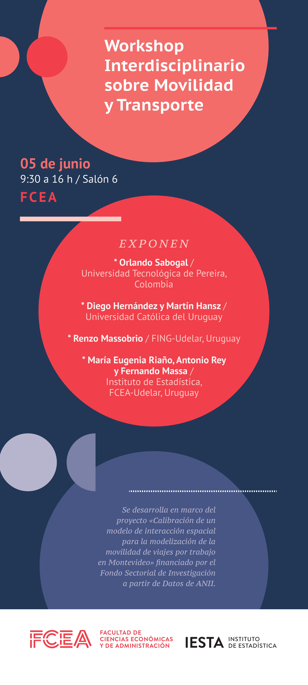

# Detalles
+ **Evento**  : Workshop Interdisciplinario sobre Movilidad y Transporte
+ **Fecha**   : Miércoles 5 de Junio de 2019
+ **Horario** : 9:30 - 16 
+ **Lugar**   : Facultad de Ciencias Económicas y Administración - UdelaR
+ **Programa**: [programa](Programa_Workshop_Movilidad_y_Transporte.pdf)
+ **Contacto**: [workshop.movilidad@gmail.com](mailto:workshop.movilidad@gmail.com)

# Expositores

+ Orlando Sabogal   - Universidad Tecnológica de Pereira,  Colombia
+ Diego Hernández   - Universidad Católica del Uruguay
+ Martín Hansz      - Universidad Católica del Uruguay
+ Renzo Massobrio   - FING-Udelar, Uruguay
+ Ma. Eugenia Riaño - Instituto de Estadística, FCEA-Udelar, Uruguay
+ Antonio Rey       - Instituto de Estadística, FCEA-Udelar, Uruguay
+ Fernando Massa    - Instituto de Estadística, FCEA-Udelar, Uruguay

# Resúmenes

